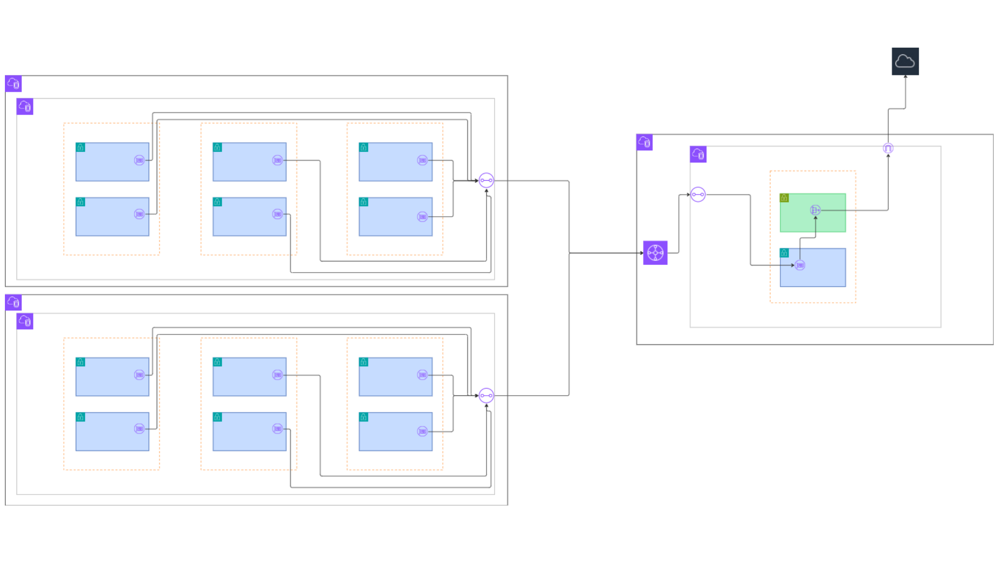

# Executive Summary: VPC Networking Standards

This document summarizes the **networking philosophy and standards** used for designing scalable, multi-account AWS environments.

The full networking standards document can be found here:  
➡️ **[VPC Networking: Hub-and-Spoke Model](./networking-hub-and-spoke.md)**

---

## Summary

As AWS environments scale beyond a few accounts, networking shifts from a configuration challenge to an **organizational and operational concern**.

The hub-and-spoke networking model provides a clean, efficient way to:
- Separate application ownership from network responsibility  
- Centralize routing, inspection, and outbound control  
- Maintain predictable traffic paths across many accounts  
- Onboard new business units or acquisitions using Infrastructure as Code  

---

## Key Principles

- **Clear Ownership**  
  Business units own workloads. Platform teams own the network backbone.

- **Centralized Control Without Centralized Workloads**  
  A shared network hub provides routing and security while allowing teams to remain autonomous.

- **Predictable Traffic Flow**  
  All ingress, egress, and east-west traffic follows known paths through controlled inspection points.

- **Scalability by Design**  
  New accounts and VPCs are added as spokes, not special cases.

---

## Why This Matters

This approach:
- Reduces operational overhead  
- Simplifies troubleshooting and auditing  
- Prevents IP overlap and routing sprawl  
- Enables consistent security controls across environments  

Most importantly, it allows organizations to **grow without repeatedly redesigning their network**.

---

## What This Enables Next

This networking standard serves as the foundation for:
- Centralized audit and logging
- Identity and access boundaries
- Shared services platforms
- Secure data and ML infrastructure

Each of those topics builds directly on the hub-and-spoke model described in the full document.

---

📌 **Next Step**  
Read the full networking standards here:  
➡️ **[VPC Networking: Hub-and-Spoke Model](/docs/VPC-README.md)**